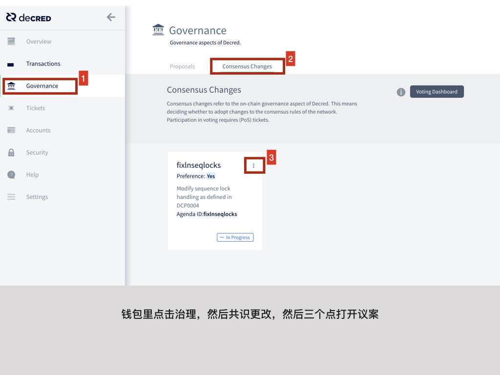
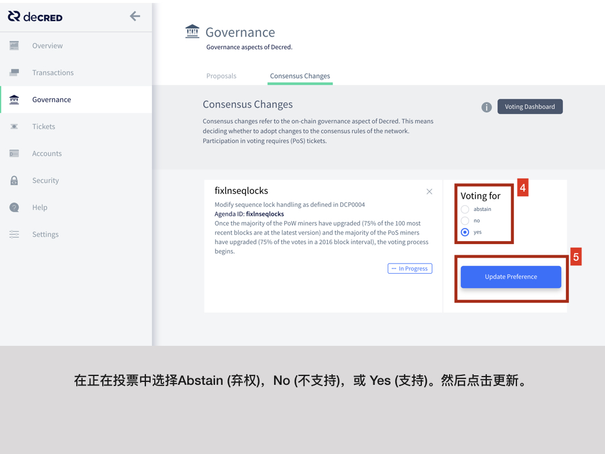

#  共识规则更改投票

本指引最后更新为 2017年9月23日。

此页面旨在简要介绍共识规则投票的工作原理，并详细说明设置选票以对任何议程作出投票的过程。

---

## 介绍

通过投票来实施共识更改将产生硬分叉情景，投票过程通过两阶段来实施。

首先，重要注意 Decred 区块链已经为投票过程专门指定了两个不同的区间。每 2016 区块（约1周）为**投票版本间隔**(**SVI**)和 每 8064 区块（约4周）为**规则更改间隔**（**RCI**）。每 1 个 RCI 里有 4 个 SVI。

投票过程的第一步是满足网络的升级门槛。在发布硬分叉代码（例如 v1.0.0 中的 sdiff 算法更改）之后，大多数参与PoW/PoS的网络上的节点需要首先升级，然后才能安排投票开始。对于工作量证明(Proof-of-Work)，在1000个最近的区块中至少有95％必须具有最新版本区块。对于权益证明(Proof-of-Stake)，在单个 **SVI** 中投票的75％选票必须拥有最新版本选票。一旦满足矿工和选民升级门槛，投票将安排在下一个 **RCI** 的第一个区块开始（由于每个 **RCI** 有 4 个 **SVI**，下一个 **RCI** 有可能在高达 6048 区块（3 个 **SVI**）后才开始。 

这个过程的第二步就是实际投票了。在单个 **RCI** 中，最高选票数为 40320 票。投票在 **RCI** 的最后一个区块进行计算，结果在下一个区块被开采之前确定。

投票结果有以下几种可能：

1. 如果投票 RCI 中超过 90％ 的选票都是 “弃权” 票，则下一个 RCI 中继续进行议程投票。
2. 如果投票 RCI 内的非弃权投票均未达到 75％ 是或否多数门槛，则下一个 RCI 中继续进行议程投票。
3. 如果投票 RCI 中 75％ 的非弃权投票支持议程（“是”），则议程被视为锁定，并且在投票通过后的 8064 个区块后激活共识更改。
4. 如果投票 RCI 中 75％ 的非弃权投票反对议程（“否”），则议程失败，共识变更将永远不会被激活。
5. 如果议程在达到 75％ 多数票之前到期，则议程过期，共识变更将不会被激活。

下面是具有共识升级议程的周期图。

---

## 参与投票

要参与投票，首先您必须拥有钱包。如果您还未设立钱包，请参考[Beginner Guide](https://docs.decred.org/getting-started/beginner-guide/)，选一个钱包并进行按照指引安装及设置。

接下来，您需要学习 [Proof-of-Stake](https://docs.decred.org/proof-of-stake/how-to-stake/)的基础知识。您需要能够使用您选择的应用程序[购买选票](../../proof-of-stake/how-to-stake.md)。

最后，您需要学会如何设置选票的 “votechoice”，以便为议程投票 “支持(Yes)”，“不支持(No)” 或 “弃权(Abstain)”。默认情况下，您的选票设置为 “弃权”。要设置投票选择，请参阅我们的[如何投票](https://docs.decred.org/governance/consensus-rule-voting/how-to-vote/)指南。

---

## 验证您的投票

验证您的选票实际投票选择最简单方法是通过[区块浏览器](https://explorer.dcrdata.org)查看您的每张选票。

区块浏览器已更新显示每张选票对于每个议程的 “支持（YES）”，“不支持（NO）” 和 “弃权（ABSTAIN）” 投票选择。以下示例图像中的第一张和第二张票对两个议程都投了 “弃权(ABSTAIN)”，而第三张票对两个议程都投了“支持(YES)”。当投票开始时，图像将更新以反映最新议程。

---

## 跟踪投票进度

[voting.decred.org](https://voting.decred.org) 是跟踪升级和投票进度的官方网站。

## 共识更改投票教程

