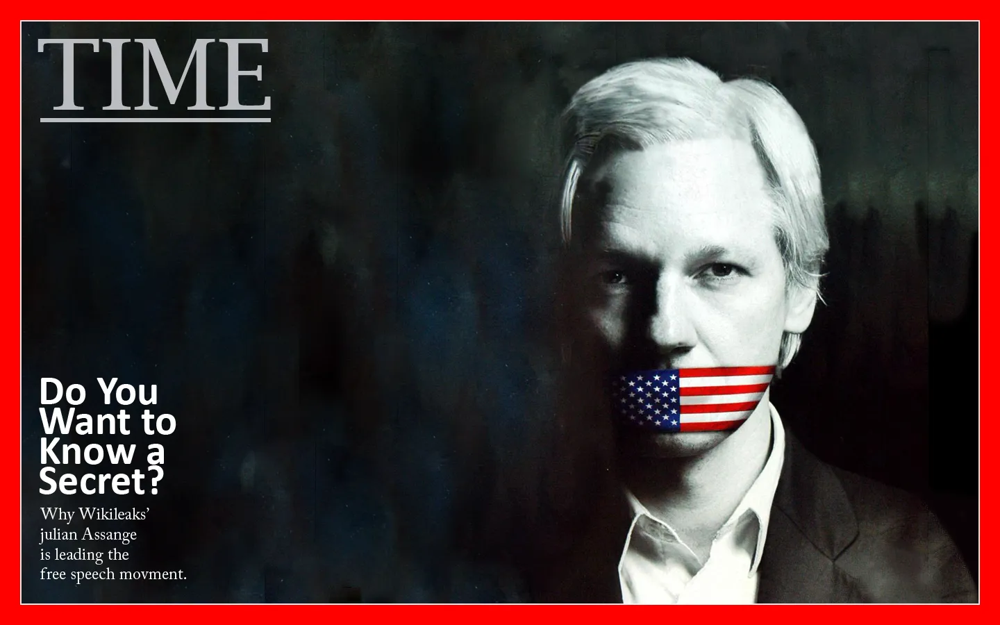

# 密码朋克文化：起源 (1/2) 

作者：TALL AMERICANO

> 探索密码朋克运动的起源、关键人物和核心原则

## 介绍

20世纪末，密码朋克运动从早期的互联网论坛中兴起。密码朋克是一群有远见的个人，他们相信加密工具有潜力将人们从集中控制中解放出来。他们设想了一个未来，技术将充当盾牌，保护用户的隐私和公民自由。通过倡导广泛使用强加密，密码朋克运动为注重隐私的技术和有影响力的宣言的发展奠定了基础。这些仍然影响着当今有关数字权利和线上自由的讨论。

了解密码朋克运动的起源将使您了解为什么它仍然很重要。回顾这一切是如何开始的，我们可以一睹20世纪末的世界，尤其是随着个人电脑和早期互联网的兴起。它帮助我们了解为什么密码朋克如此关心隐私和技术。这一背景还帮助我们了解密码朋克如何应对加密战争期间的挑战，他们为使用强加密而奋斗。了解所有这些历史有助于让我们明白为什么这些想法仍然很重要，影响着开源软件、去中心化系统和新的注重隐私的创新等事物。

本文探讨了该运动的起源、关键人物以及《密码朋克宣言》中阐述的核心原则，为理解其历史根源及其在数字权利和网络自由讨论中的意义奠定了基础。

如果您想了解更多信息，下面的链接提供了密码朋克的简要历史：

