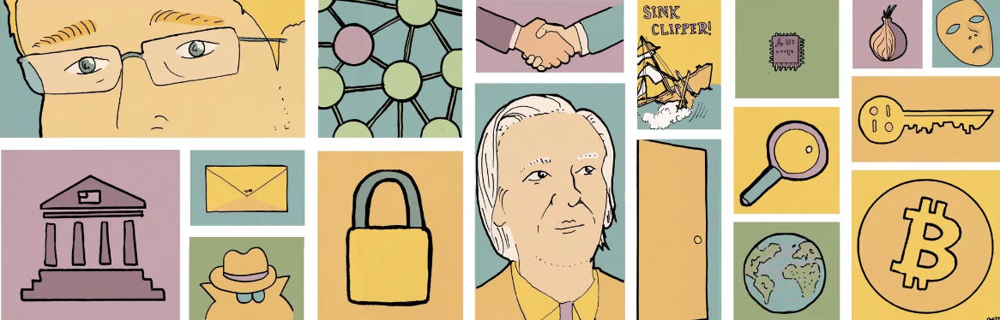

# 密码朋克文化：起源 (1/2) 

作者：TALL AMERICANO

> 探索密码朋克运动的起源、关键人物和核心原则

## 介绍

20世纪末，密码朋克运动从早期的互联网论坛中兴起。密码朋克是一群有远见的个人，他们相信加密工具有潜力将人们从集中控制中解放出来。他们设想了一个未来，技术将充当盾牌，保护用户的隐私和公民自由。通过倡导广泛使用强加密，密码朋克运动为注重隐私的技术和有影响力的宣言的发展奠定了基础。这些仍然影响着当今有关数字权利和线上自由的讨论。

了解密码朋克运动的起源将使您了解为什么它仍然很重要。回顾这一切是如何开始的，我们可以一睹20世纪末的世界，尤其是随着个人电脑和早期互联网的兴起。它帮助我们了解为什么密码朋克如此关心隐私和技术。这一背景还帮助我们了解密码朋克如何应对加密战争期间的挑战，他们为使用强加密而奋斗。了解所有这些历史有助于让我们明白为什么这些想法仍然很重要，影响着开源软件、去中心化系统和新的注重隐私的创新等事物。

本文探讨了该运动的起源、关键人物以及《密码朋克宣言》中阐述的核心原则，为理解其历史根源及其在数字权利和网络自由讨论中的意义奠定了基础。

如果您想了解更多信息，下面的链接提供了密码朋克的简要历史：[密码朋克的简史](https://medium.com/thedarkside/a-brief-history-of-the-cypherpunks-31ae447a14f)

> 链接文章粗略地概述了该组织不仅在互联网的形成中发挥的作用，并且还参与了加密货币的兴起。

## 背景：前密码朋克时代

20 世纪 70 年代和 80 年代，随着个人计算的兴起和互联网的出现，我们见证了一场革命性的转变。微处理器的引入使计算能力民主化，而不仅仅是大型机构才能使用。微处理器使得将计算机的基本功能集成到单个芯片上成为可能，从而能够创建更小、更便宜的计算机。这导致个人拥有 Apple II 和 IBM PC 等个人电脑。与此同时，互联网的前身阿帕网(ARPANET)的发展为全球互联计算机网络奠定了基础。随着这些技术的融合，互联网发生了变革，以前所未有的方式连接个人和信息。

随着技术的迅猛发展，人们对隐私的担忧也随之增加。大型计算机、电话和电子邮件等早期通信技术的使用引发了有关个人数据和私人对话安全的讨论。政府和企业对电子数据系统的日益依赖凸显了强有力的隐私保护的必要性。在技​​术扩张和对隐私日益关注的背景下，密码朋克运动应运而生。

除了前密码朋克时代之外，下面是一篇关于比特币诞生和密码朋克崛起的精彩文章：[比特币和密码朋克的崛起](https://www.coindesk.com/markets/2016/04/09/bitcoin-and-the-rise-of-the-cypherpunks/?ref=cypherpunktimes.com)

> 很明显，密码朋克几十年来一直在彼此的工作基础上进行构建，在 2000 年代试验并奠定了我们所需的框架，但关键点是 2000 年代密码朋克货币的创建。

## 密码朋克的前身

在密码学领域，惠特菲尔德·迪菲 (Whitfield Diffie) 和马丁·赫尔曼 (Martin Hellman) 是密码朋克运动的先驱。 1976 年，他们提出了公钥密码学的想法，这是人们安全交谈的一种方式。这就像拥有两把钥匙——一把用来锁定消息，另一把用来解锁消息，从而使数字对话变得私密。这一运动的另一位关键人物是大卫·乔姆（David Chaum）在 20 世纪 80 年代，引入了混合网络和数字现金等很酷的想法，想象了一个人们可以在不泄露自己身份的情况下进行私人交易的世界。

随着计算机在 20 世纪 90 年代变得越来越普遍，人们开始使用早期的互联网。大型计算机和新的连接方式引发了人们对个人信息安全的担忧。电话和电子邮件变得越来越流行，但人们担心他们的谈话是否私密。政府和大公司也大量使用电子系统，这让人们思考如何保护自己的隐私。密码朋克运动的成员惠特菲尔德·迪菲 (Whitfield Diffie)、马丁·赫尔曼 (Martin Hellman) 和大卫·乔姆 (David Chaum) 等人看到了这些变化，并知道未来可能会出现隐私问题。他们希望使用特殊的代码和工具来保证人们的信息安全，并确保个人能够控制自己的隐私。

如果您想了解更多有关“谁是密码朋克”的信息，请阅读以下文章：[谁是密码朋克](https://medium.com/coinmonks/who-were-the-cypherpunks-c6f081689e16)

我们密码朋克致力于构建匿名系统。我们通过密码学、匿名邮件转发系统、数字签名和电子货币来保护我们的隐私。

## 密码朋克文化的诞生

密码朋克文化的起源与具有前瞻性思维的个人的聚集密切相关，埃里克·休斯、蒂莫西·C·梅和约翰·吉尔摩等关键人物发挥了关键作用。埃里克·休斯 (Eric Hughes) 是一位数学和计算机奇才，因创造“密码朋克”一词并塑造该运动的理想而闻名。来自英特尔的技术专家蒂莫西·C·梅 (Timothy C. May) 将他的技术技能融入到密码朋克哲学中，特别是在早期的演讲中，强调使用密码工具来增强个人能力以对抗监控。电子前沿基金会 (EFF) 的联合创始人约翰·吉尔摩 (John Gilmore) 带来了技术知识和对公民自由的热情。吉尔摩对互联网自由和计算机科学的奉献极大地影响了早期的密码朋克运动。

“cypherpunk”一词由 Eric Hughes 在 20 世纪 90 年代初创造，是“cipher”和“punk”的混合体，具有强大的含义。它抓住了不断发展的文化和技术运动的本质，其中个人反抗传统规范。休斯创造了这个术语来表示一个致力于使用加密工具来保护个人隐私和独立的团体。 “密码”部分强调了密码学在保护通信方面的作用，而“朋克”部分则标志着一种叛逆的草根方法。 “密码朋克”不仅仅是一个技术标签，它是一个战斗口号，象征着利用密码学赋予个人对抗权威并创造一个去中心化、注重隐私的未来的承诺。它体现了一种挑战传统权力结构的反叛精神。

密码朋克运动以在线讨论和邮件列表拉开序幕，热衷于密码学、隐私和个人自由的人们将其联系在一起。像 Cypherpunks 邮件列表这样的平台成为了分享想法和技术见解的中心。这些演讲很活跃，充满了关于密码学如何保护隐私和挑战中央控制的想法。这些在线空间聚集了来自密码学、计算机科学、法律和激进主义等各个领域的专家。在这些虚拟论坛中，埃里克·休斯 (Eric Hughes)、蒂莫西·C·梅 (Timothy C. May) 和约翰·吉尔摩 (John Gilmore) 等人物找到了共同点，塑造了密码朋克运动的基本原则。这些早期的讨论在志同道合的个人之间创造了一种社区意识，他们拥有使用密码学保护个人自由的共同愿景。

如果您想了解有关“密码朋克的诞生”的更多信息，请参阅以下文章：[密码朋克的诞生](https://medium.com/@cipherpunks/the-birth-of-cypherpunks-311a5a458598)

> 他们相信编写代码可以帮助匹配并击败集权，而无需任何直接行动。他们非常热衷于密码学并且喜欢实践它。

## 密码朋克宣言

埃里克·休斯 (Eric Hughes) 于 1993 年撰写了《密码朋克宣言》，阐述了密码朋克运动的核心原则。该宣言强调隐私是一项基本权利，提倡强大的加密技术，以保护个人通信免受不必要的监视。休斯设想了一个去中心化的未来，个人可以控制自己的数字身份，促进自治并减少政府和企业滥用权力的可能性。该宣言作为哲学基础，主张使用加密工具来维护公民自由以及控制安全和自治的能力。密码朋克运动的核心理念是个人自由、隐私和密码学的力量紧密相连。

埃里克·休斯 (Eric Hughes) 的密码朋克宣言：(密码朋克宣言)[https://nakamotoinstitute.org/static/docs/cypherpunk-manifesto.txt?ref=cypherpunktimes.com]

> 我们密码朋克致力于构建匿名系统。我们通过密码学、匿名邮件转发系统、数字签名和电子货币来保护我们的隐私。

## 结论

总之，我们的密码朋克文化文章的第一部分概述了密码朋克宣言中概述的历史根源、关键人物和基本原则。我们已经讨论了理解 20 世纪 70 年代和 1980 年代社会政治和技术背景的重要性，Whitfield Diffie、Martin Hellman 和 David Chaum 等早期贡献者为一场重塑技术、隐私、和个人自由。埃里克·休斯 (Eric Hughes) 提出的《密码朋克宣言》作为指导思想，强调密码学在保护个人隐私方面的关键作用。随着我们的前进，下一篇文章将深入探讨密码朋克的技术愿望。探索他们所倡导的开创性技术、他们对加密货币战争的参与、他们的理想的演变以应对不断变化的技术格局。以及早期密码朋克思想的持久遗产。通过继续这一探索，我们的目标是更好地了解密码朋克运动是如何出现的，以及它的原则和创新如何继续塑造密码学和数字隐私的当前和未来格局。

## 关于译者

编译 ：[@Dominic](https://twitter.com/wanbihou)

欢迎反馈至[Github](https://github.com/DominicTing)或联系作者

原文链接：[原文](https://www.cypherpunktimes.com/cypherpunk-culture-unraveling-the-origins/)
