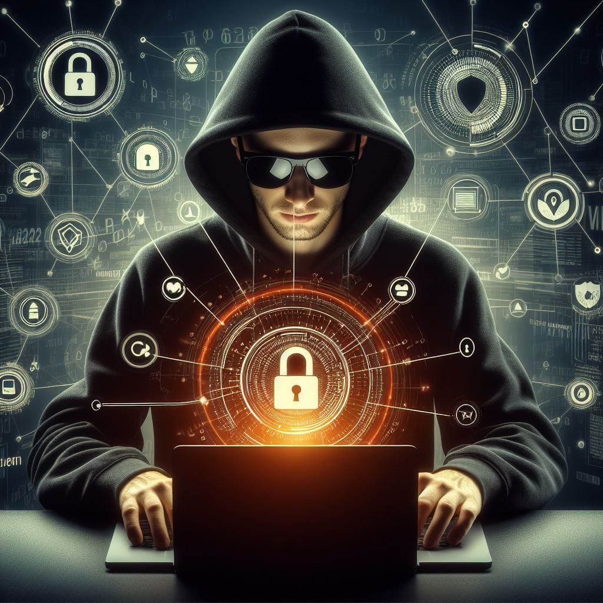
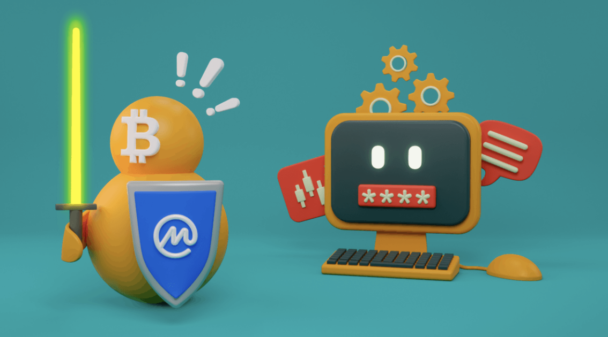

# 密码朋克文化：揭开起源 (2/2)

作者：TALL AMERICANO

> 密码朋克旨在通过创建数字现金和匿名交易系统来彻底改变数字交易。

## 介绍

当我们继续揭开密码朋克运动的起源时，我们的探索转向了推动这一亚文化的技术愿望。

在第二部分中，我们将介绍密码朋克倡导的开创性技术。这让我们看到了创造性工具的出现，特别是 齐默尔曼(Phil Zimmermann) 开发的 Pretty Good Privacy (PGP)。密码朋克是革命家，他们设想了一个数字隐私成为一项基本权利的未来。

本文旨在介绍他们对加密创新的追求，重点关注数字现金和匿名交易的出现，作为他们技术愿景的关键组成部分。

## 密码朋克的技术愿望

齐默尔曼(Phil Zimmermann) 在创建 PGP 方面发挥了至关重要的作用。这成为加密通信的关键工具，使人们能够保持消息的私密性。这项技术象征着密码朋克的目标，即让个人控制自己的隐私。

PGP 作为一种加密软件程序运行，旨在保护电子通信的安全。它采用对称密钥加密和公钥加密的组合。当用户发送消息时，软件会为该特定消息生成随机对称密钥。然后使用该对称密钥来加密消息的内容。同时，PGP 使用接收者的公钥来加密随机生成的对称密钥。然后将加密的消息和加密的对称密钥发送给接收者。收到消息后，接收者使用其私钥来解密对称密钥，从而允许他们解密消息。这确保了电子通信的机密性和完整性，使个人能够安全地交换信息。 PGP在密码朋克运动中的意义在于运动的理想，强调通过密码工具赋予个人权力。

来自 Wikipedia 的链接提供了有关 PGP 的进一步阅读：[pretty Good Privacy](https://en.wikipedia.org/wiki/Pretty_Good_Privacy?ref=cypherpunktimes.com)

> 1991 年的这一天，我将 PGP 的第一个版本发送给我的几个朋友，并上传到互联网上。首先，我将其发送给 Allan Hoeltje，后者将其发布到 Peacenet，这是一家专门从事草根政治组织（主要是和平运动）的 ISP。

密码朋克旨在通过推动数字现金和匿名交易系统的创建来彻底改变数字交易。他们设想了一种货币形式，允许人们在不透露身份的情况下进行交易，优先考虑隐私。这涉及开发加密协议和去中心化系统，以确保安全和私密的在线交易。通过利用他们在密码学和计算机科学方面的专业知识，他们的目标是建立一个独立于中央集权机构之外的金融体系，强调个人自由和隐私。这些讨论导致了加密货币和区块链技术的发展。

## 加密战争中的密码朋克

在政府反对并试图监管密码学期间，密码朋克积极参与加密之战。面对当局寻求控制强加密使用的挑战，他们坚定捍卫隐私和公民自由的重要性。随着加密技术的普及，各国政府对国家安全和执法表示担忧。作为回应，当局旨在控制和限制强加密的使用，担心这会阻碍监视工作。

第一次 ***加密战争*** 于 90 年代初展开，其特点是对加密的使用持有不同看法的各派系之间发生利益冲突。一方面是由克林顿政府和国家安全局（NSA）等情报机构带头的美​​国政府。他们寻求对加密技术进行更大的控制，并担心不受监管的加密可能会助长犯罪和恐怖活动，对国家安全构成威胁。包括电子前沿基金会 (EFF) 和美国公民自由联盟 (ACLU) 等组织在内的隐私倡导者反对政府的尝试，认为这是对个人自由和隐私的侵犯。与此同时，密码学研究人员、爱好者以及由菲尔·齐默尔曼 (Phil Zimmermann) 等人物领导的松散附属团体密码朋克 (Cypherpunks) 在倡导使用加密方面发挥了关键作用。

第二次 ***加密战争*** 是由一些关键事件引发的，这些事件重新引发了全球对加密、隐私和安全的讨论。爱德华·斯诺登 (Edward Snowden) 2013 年的爆料，揭露了美国政府的大规模监控，引发了关于隐私权和加密的广泛讨论。与此同时，在通信平台中采用端到端加密，例如 WhatsApp（2014 年）、Signal（2013 年）和 Apple 的 iMessage（2011 年），成为讨论的核心。与 90 年代专注于特定加密技术的分发和出口的前身不同，第二次加密战争解决了更广泛的加密集成问题。这场冲突具有更大的全球影响力，涉及全球范围内的政府、科技公司和隐私倡导者。

下面的链接提供了对加密战争的更详细的探索：[加密战争和密码朋克运动](https://medium.com/@cryptofemme/crypto-wars-the-cypherpunk-movement-5c2fa4b7443a)

> 总的来说，DES 的创建是密码学历史上的一个重要里程碑，因为它催生了军事用途之外的加密算法的发展。

[第一次加密战争](https://coinmarketcap.com/academy/article/the-first-crypto-war?ref=cypherpunktimes.com)

> 很久以前，在互联网的早期，一场关于在线隐私和自由的加密战争发生了——这就是所谓的第一次加密战争。

[第二次加密战争](https://coinmarketcap.com/academy/article/second-crypto-war?ref=cypherpunktimes.com)

> 探索第二次加密货币战争在平衡隐私和政府监控方面的历史、关键参与者和影响，以及它如何影响加密货币领域。

## 密码朋克理想的演变

数字隐私很大程度上依赖于数字安全，其中加密技术是关键要素。密码学不仅可以保护日常交易的安全，还可以支撑区块链和匿名网络等技术，旨在挑战政府的控制。

尽管遭到执法部门的抵制，密码朋克意识形态仍然存在，影响着挑战当代政府政策的新一代数字隐私活动家。了解这个社区对国家监管的成功抵制为正在进行的数字隐私辩论提供了宝贵的背景。

洋葱路由(Tor) 等匿名网络和比特币等数字货币的发展受到了密码朋克理念的培育。这些技术旨在为用户提供更高的在线隐私和安全性。

链接提供了对该意识形态的深刻见解：

[密码朋克意识形态：目标、概况和影响（1992-1998）](https://www.tandfonline.com/doi/full/10.1080/24701475.2021.1935547)

## 早期密码朋克的贡献

早期密码朋克的贡献对现代密码学、隐私技术和区块链空间产生了持久的影响。他们的影响力扩展到了区块链等技术，使私人和安全的金融交易超越了政府的监控。使用匿名网络反映了密码朋克挑战集中控制的理想。他们的原则影响了开源软件和去中心化系统的开发。密码学的进步促进了加密货币和其它隐私工具的创新。

## 结论

从本质上讲，Cypherpunks 凭借他们的技术愿景和 Pretty Good Privacy (PGP) 等创新塑造了我们今天所拥有的数字隐私。密码朋克参与了加密战争，抵制政府的反对，捍卫隐私权，巩固了他们对加密工具的承诺。尽管有人认为密码朋克的影响力到 2000 年有所下降，但密码朋克意识形态依然存在，激励着新一代的数字隐私活动家。

## 关于译者

编译 ：[@Dominic](https://twitter.com/wanbihou)

欢迎反馈至[Github](https://github.com/DominicTing)或联系作者

原文链接：[原文](https://www.cypherpunktimes.com/cypherpunk-culture-unraveling-the-origins-2-2/)
