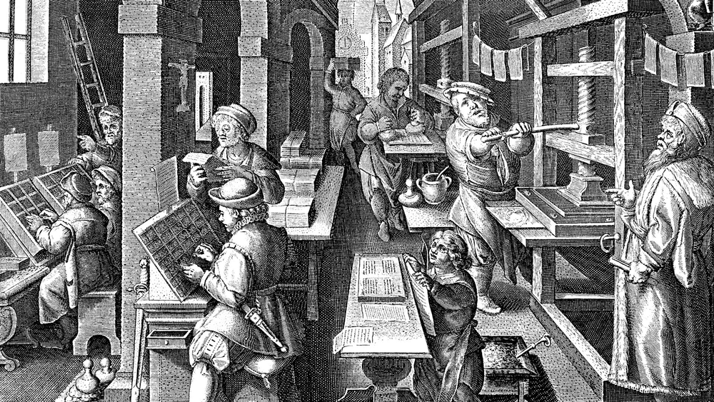
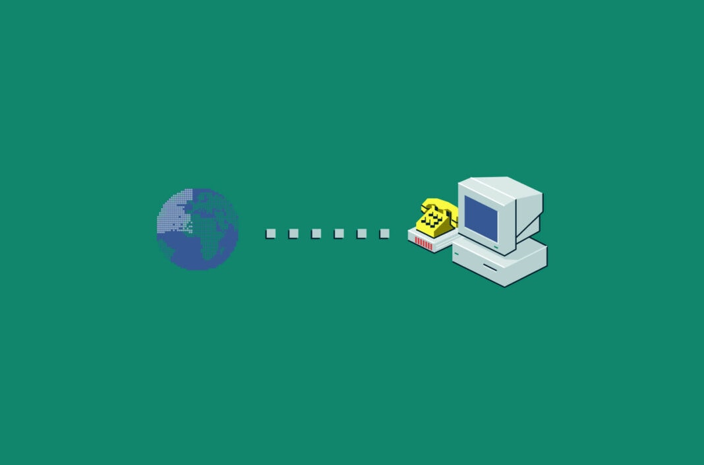
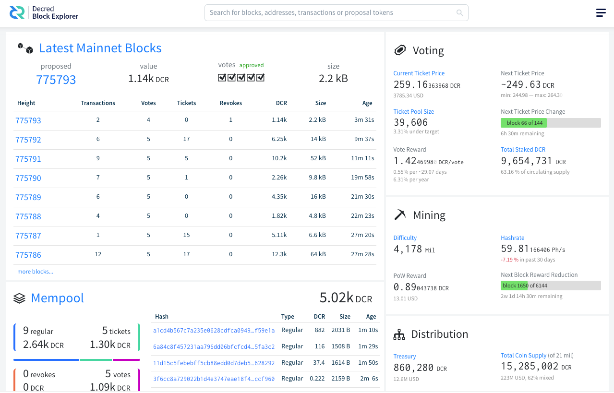

# 权力下放简史

作者：Joao Paulo Sant'Anna da Silva

> 媒体控制权长期以来集中在少数人手中。他们决定谁可以发送信息，以及可以传播什么类型的信息。

法国大革命无疑是现代史上倍受研究的事件之一。这一历史事件导致了欧洲君主制的衰落和社会权利理念的普遍化。1794年革命期间，该国的国家目录中出现了“中央集权”一词，同时创建了新的政府结构。二十年后，“去中心化”一词开始使用。当时著名的政治哲学家亚历克西斯·托克维尔说：

> “法国大革命始于推动权力下放……[但最终成为]集权的延伸。”

亚历克西斯·托克维尔，权力下放哲学家

在过去的几个世纪里，去中心化思想被各种思想家和活动家传播。这些人想要对抗集权的权力结构，促进一个更加公平和有参与性的社会。他们自称为“无政府主义者”和“自由主义者”。托克维尔是这个新概念的倡导者，他不断地谈论它的重要性：

“权力下放不仅具有行政价值，而且具有公民维度，因为它增加了公民对公共事务感兴趣的机会；它使他们习惯于使用自由。在这些地方性的、积极的、挑剔的自由的积累中，天生就是对中央政府主张的最有效的制衡手段，即使它得到了非个人的集体意志的支持。”

长期以来，世界是一个权力没有分散的状态。君主和皇帝是权力的主要来源，普通民众对自己的生活/国家没有决定权。一些发明负责在历史上分散权力，让人们思考各自的社会和其它领域。以下是一些改变游戏规则的想法，帮助人类社会分散和平衡权力。

## 印刷机

随着印刷机的出现，书籍开始在民间流行起来

古腾堡在 1430 年左右开发了印刷机。古腾堡的印刷机由一个平板组成，上面排列着活动字符。这些活动字符只不过是用铅铸成的图形符号（字母、数字、标点符号等）。在这些单个模具在涂上墨水后，可以在几个小时内打印出大量相同文本的副本。虽然手工制作书籍（称为抄本）非常耗时，但印刷机大大减少了所需的时间。

到了 16 世纪初，古腾堡印刷机的影响已经在德国公国中显现出来，特别是当印刷机普及了改革家马丁·路德的批评小册子时。1517年路德发起的新教改革由于印刷的论文和小册子的流通而在德国识字人口中获得了广泛的接受。此外，路德对阅读史的贡献与古腾堡的印刷机密切相关：将圣经从拉丁文翻译成德文。

总的来说，印刷机的发明加速了思想和知识的传播。在出版之前，即使是最流行的书籍，如《圣经》，也是手写的，而且很少见。它发明后，书籍开始大量印刷，人们可以获得只有精英才能获得的信息。知识就是力量，去中心化的知识意味着给人们更多的力量！

## 互联网

互联网将世界各地的人们联系在一起

媒体控制权长期以来集中在少数人手中。他们决定谁可以发送信息，以及可以传播什么类型的信息。电视和广播是改变了数百万人生活的发明，但它们始终是单向通信设备。

互联网诞生之后，任何人都可以在数百万人的网络中表达自己的观点。每个有联系的人都可以在互联网上发出声音，能够做出判断，也能够被判断。互联网内部的中心化仍然存在许多问题。谷歌和 Meta 等大型科技公司控制着大部分内容，并且可以审查他们不喜欢的内容。尽管这些公司对在线媒体拥有不成比例的控制权，但互联网仍然是一种去中心化工具。普通人能够与世界各地的人们交流，分享经验和想法。有许多开源/协作计划，人们可以一起构建一个项目，即使他们在现实生活中从未见过面。

Bison Relay 是与大型科技中心化网络相反的应用程序的一个很好的例子。Decred 项目构建了社交媒体的新面貌。Bison Relay是一个赋予用户绝对言论自由和个人信息保管主权的通讯系统。该系统提供具有端到端加密的“零知识通信”，确保只有目标收件人才能看到消息内容。它还具有抗审查性。服务器运营商无法看到用户共享哪些内容或参与哪些聊天，从而保护他们免受审查。

## 区块链/加密货币

区块链的创建是金融去中心化的重要一步

这段历史你一定听过一百遍了，但我们需要再说一遍！区块链技术始于比特币的发展，比特币是第一个去中心化的加密货币。比特币及其创造者中本聪的确切起源仍然是一个大谜团，但它对更加去中心化的社会的贡献是显而易见的。区块链旨在成为透明的点对点金融交易的安全网络，无需中央机构即可解决双重支付问题。自大型银行和股票经纪人统治金融交易以来，传统金融体系可能是最难对付的机构。自比特币区块链创建以来，开发了许多其他平台和加密货币，每个平台和加密货币都有其独特的功能和用例。

需要强调的一个项目是 Decred，它是去中心化加密项目的一个值得注意的例子。Decred 被认为是真正的 DAO 有一些原因：

### 治理模式

Decred 采用混合共识机制，将工作量证明挖矿与权益证明投票相结合。矿工和利益相关者在决策过程中都有发言权。每个利益相关者都可以在Politeia平台上对提案进行投票，决定协议变更、营销策略和开发创新。

### 社区参与

Decred 非常重视创建一个包容性的社区。鼓励在Matrix、Twitter和Bison Relay上的项目官方渠道进行对话和辩论。社区成员可以为项目做出贡献并获得 DCR 奖励。

### 对透明度的承诺

Decred 优先考虑决策过程和整体运营的透明度。每笔支出都是公开的，并且该项目的代码是开源的，使任何人都可以审查该项目。

Decred 区块浏览器是 Decred 透明度精神的一个很好的例子

您认为还有哪些其他举措使其走在了权力下放的正确道路？请在下面发表评论！

## 关于作者

编译 ：[@Dominic](https://twitter.com/wanbihou)

欢迎反馈至[Github](https://github.com/DominicTing)或联系作者

原文链接：[原文](https://www.decredmagazine.com/how-did-we-get-here-a-brief-history-of-decentralization/)

