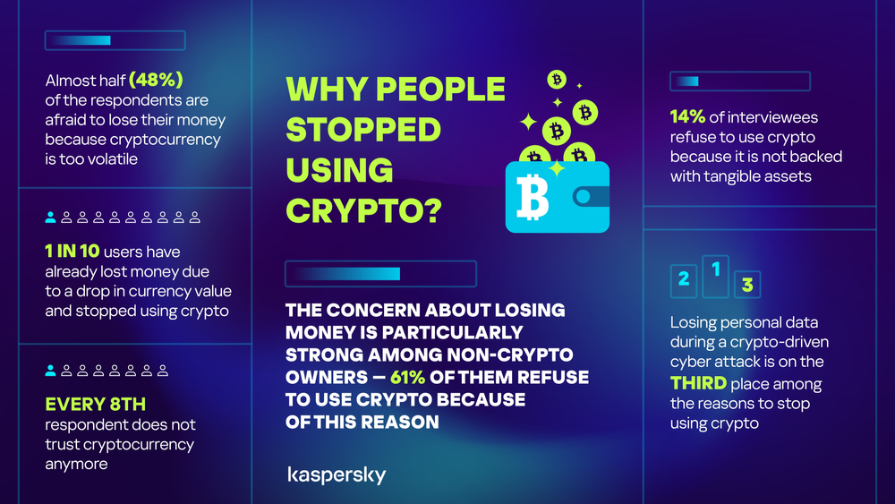
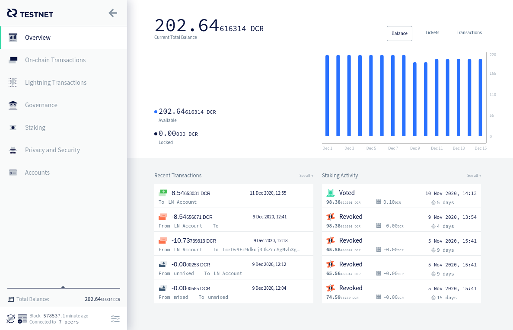

# 安全是加密货币投资者最关心的问题

作者：Joao Paulo Sant'Anna da Silva

> 加密货币正在经历一个新阶段，许多人有兴趣加入，但也有许多人担心其安全性和波动性。

卡巴斯基最近进行的研究列出了当研究对象是加密货币市场时人们最关心的一些问题。不稳定是那些尚未投资任何加密货币的人的障碍之一。然而，在投资者中，安全性被大多数受访者视为头疼的问题。让我们分析这项研究并深入了解人们与加密货币的关系。

### 波动性

价格的大幅波动是加密货币更广泛采用的主要障碍。卡巴斯基的研究表明，48% 的受访者害怕购买加密货币，因为他们不想冒失去金钱的风险。10%的受访者已经因货币贬值而遭受过经济损失。对潜在损失的担忧也超出了现有的加密货币持有者的范围。令人惊讶的是，61% 的非加密货币所有者不愿意投资加密货币，因为他们担心自己的资金面临风险。

### 意识

只有 25% 的受访者认为自己充分了解加密货币所有者面临的潜在威胁，近 23% 的人承认没有任何信息。这一统计数据凸显了需要克服的重大知识差距，以使所有人的加密体验更加安全。

年龄在投资者的意识水平中发挥着重要作用。35岁以下的年轻人往往更了解市场风险。

在投资加密货币的巴西受访者中，63% 的人将自己归类为新手——也就是说，他们刚进入该领域不到一年 —— 而 37% 的人已经将自己视为专业人士。当被问及是否有任何在线安全问题时，55% 的人指出在线电子邮件或电话诈骗。卡巴斯基拉丁美洲全球研究与分析团队总监法比奥·阿索里尼 (Fabio Assolini) 表示，网络钓鱼是巴西网络犯罪的主要策略。

“因为它很便宜，而且巴西人非常有创造力——这使得他们能够创造出令人信服的诱饵”。

网络钓鱼攻击通过电子邮件或短信进行，冒充可信来源，窃取信用卡号、密码和登录信息等机密数据。

网络钓鱼是涉及加密货币的最常见诈骗之一

### 保护与监管

49% 的受访者认为当前的加密保护系统无效，31% 的受访者认为这些协议很少或根本没有提供针对威胁的保护。54% 的参与者希望看到独立机构的监管。72% 的受访者中的绝大多数批准打击加密货币网络犯罪的立法。

### 加密货币的使用和期望

赚取尽可能多的利润仍然是 33% 受访者的最大动机。在线购买支付紧随其后（29％），这表明尽管加密货币市场渴望赚钱，但它还有许多其他功能可供用户使用，例如汇款、捐赠和实物购买。

超过一半的受访者 (53%) 表示，他们对自己持有的加密货币感到“相当满意”或“满意”。相比之下，29％的参与者表示他们对加密货币的期望得到了部分满足，这表明满意度低于他们最初的希望。此外，9% 的人后悔购买加密货币，这一数字在欧洲更高，其中 11% 的人后悔投资加密货币。

## Decred 和安全性

Decred 将安全性视为在项目内部建立信任时的一个基本问题。Decred 社区通过多种方式致力于创建一种安全的货币及其管理方法。

### Decrediton

Decrediton 是 Decred 的官方钱包和图形用户界面。它是管理 $DCR 的综合工具。安全性是该应用程序的首要任务，它利用强大的加密技术来保护钱包文件，并具有种子备份等功能，以确保用户在设备丢失或故障时可以恢复资金。

使用 Decrediton 运行完全验证的节点比使用任何其他协议或钱包提供商更容易。用户不需要信任第三方提供商来验证他们的交易。在用户完全保管 $DCR 和交易时的安全方面，Decred 不会妥协。

Decrediton 界面

Decrediton 还允许用户设置访问控制，例如定义密码或 PIN 来访问钱包或处理交易。应用程序中还包含 StakeShuffle 等隐私功能。通过加大追踪资金动向的难度，用户的隐私得到保护。

### Decred 效率

Decred 利用工作量证明 (PoW) 和权益证明 (PoS) 的混合共识，提供了强大的安全模型。该项目在减少攻击向量方面非常有效，运行七年多后，Decred 的区块链大小目前刚刚超过 10GB。

该项目作为仅支持硬分叉协议运行，所有用户都运行相同版本的规则。每一项变更都需要通过 Politeia 治理平台进行投票。这种去中心化不允许软件分叉或链分裂来操纵协议，从而减少了攻击向量。

## 前进

加密货币正在经历一个新阶段，许多人有兴趣加入，但由于安全问题、波动性和其他问题，许多人对新投资感到担忧。Decred 需要成为一个重申其对安全性毫不妥协的项目，通过继续实施为新老投资者提供更多信心的工具和实践。

在安全方面，您认为项目下一步应该采取哪些步骤？请在下面发表评论！

