# Translation in Decred

Decred had attempts to go with community route and the process was eventually abandoned as it was difficult to do quality assurance on contributed contents, leading to quite a number of scammy submission and inconsistent rates(some bill by hours and some bill by number of words). That drove the direction to engage professional agency to perform bulk of the translation work. [Conversation here](https://matrix.to/#/!tfqymymiNgzSUJTHqS:decred.org/$154345978427541MTytB:decred.org?via=decred.org&via=matrix.org&via=zettaport.com)

The general consensus is we no longer accept community translations except for "actively involved" community members who are native speakers of a target languages. 

That said, having more community reviewers giving inputs to improve translations are very valuable. Translation service agencies who are not familiar with Decred/Blockchain/Cryptospace gives very crappy results. Community inputs to build up Glossary is crucial for consistent choice of words and translation quality. 

At the moment the workflow and prcedures are still being explored. While those are being established, the temporary solution is to have inputs from volunteering community to provide inputs, some trusted/qualified coordinator will review and approve the contributed contents.

These are currently managed with Transifex. 

For interested volunteers please sign up for a transifex account, and refer below guide. 

**Decred Project is currently not paying directly for community translations for the above mentioned reasons and only accepting reviews from known community members.**

## Transifex Guide

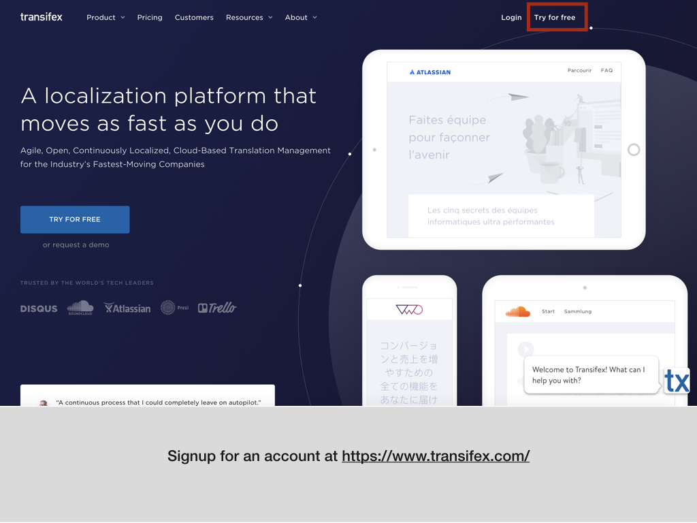
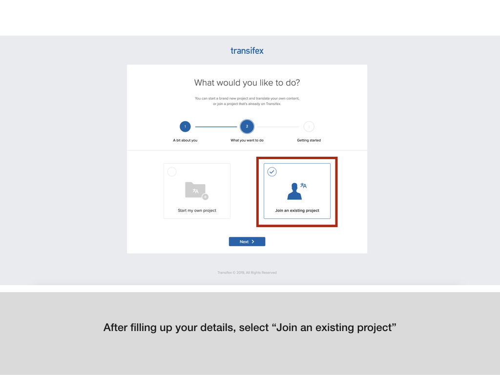
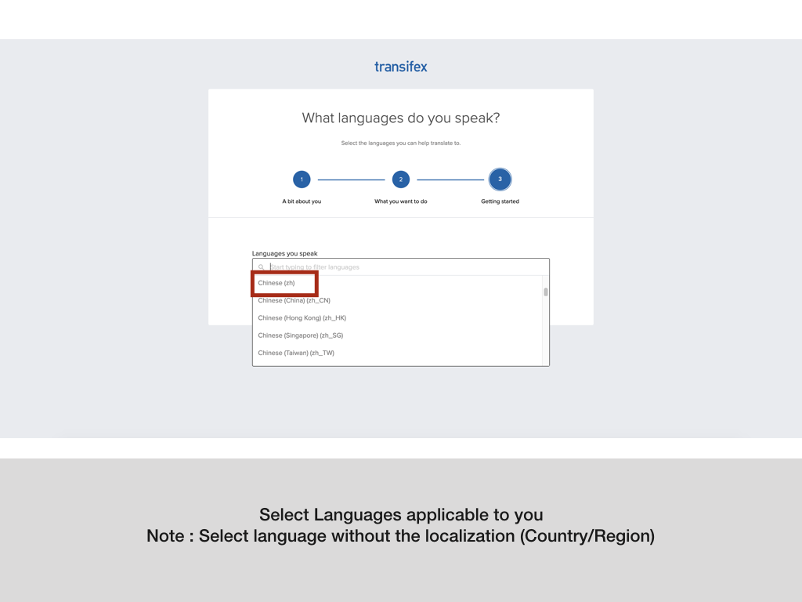
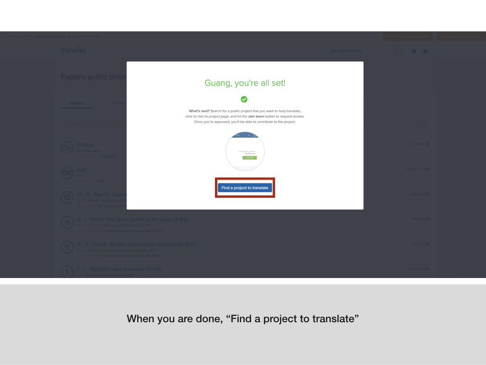
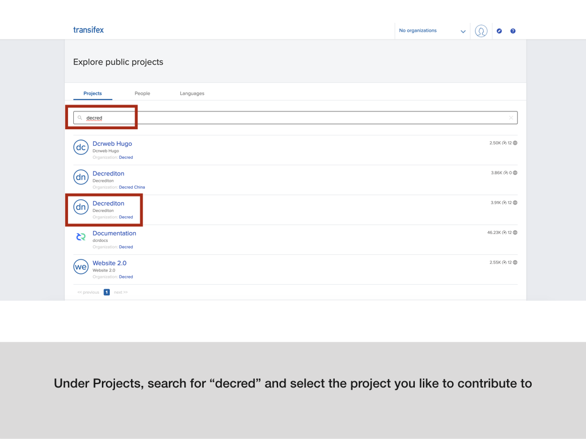
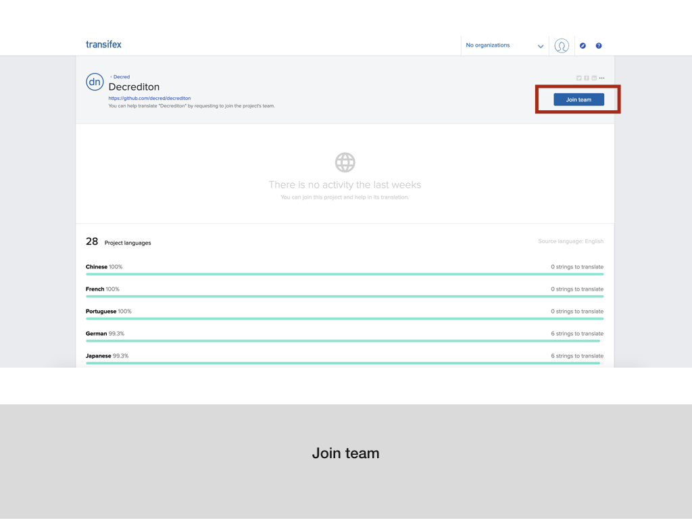
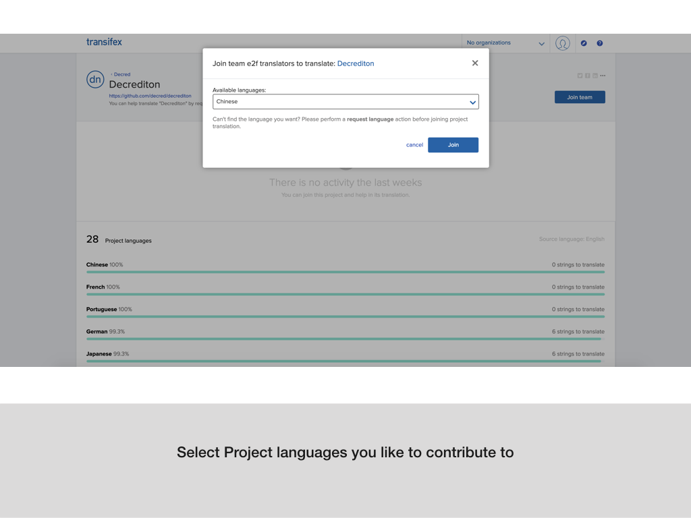
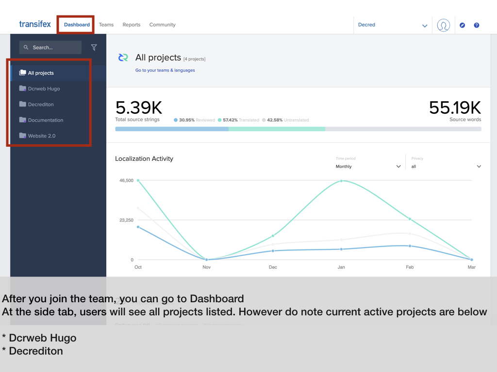
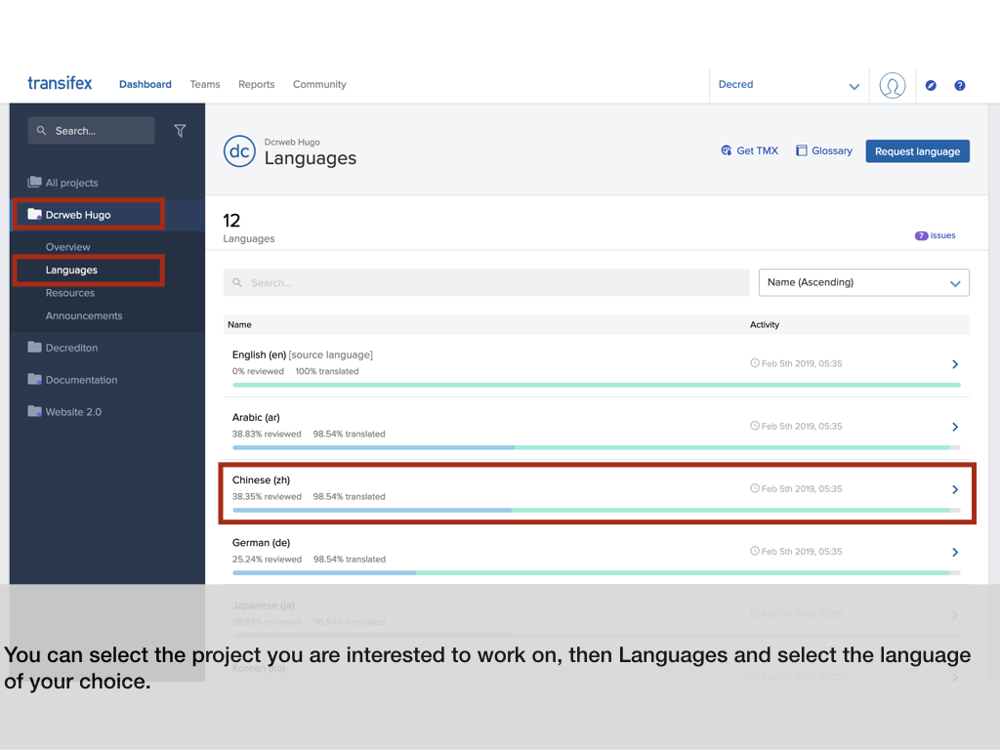

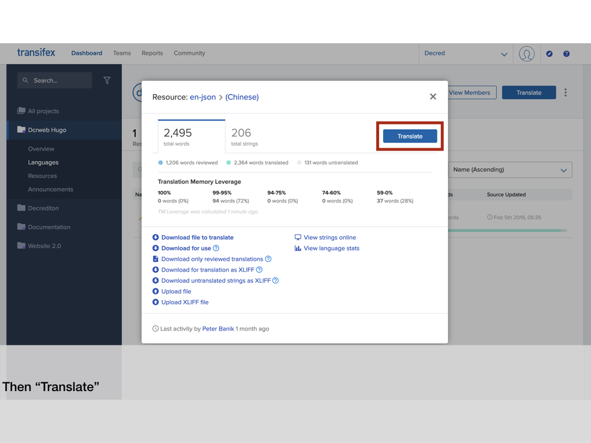
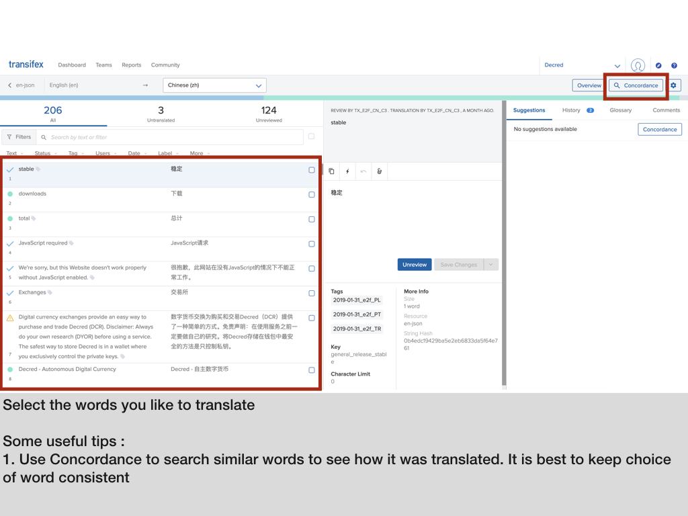
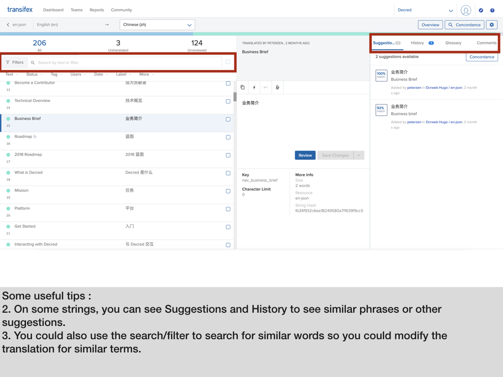
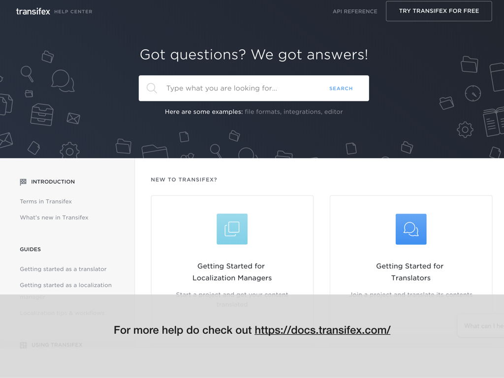

