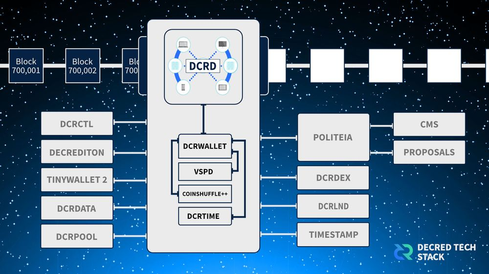

# 浅聊一下Decentralization（去中心化）

百度百科把它隐讳的解释为“是互联网发展过程中形成的社会关系形态和内容产生形态，是相对于“中心化”而言的新型网络内容生产过程”。看完百度百科的解释，你是不是想说“能不能说人话？” 那我们来看看维基百科，维基百科中它被解释为“分权&权力下放”。

没错。关键词即为分权和权力下放。我们来看看在初始的bitcoin网络中发生了什么。初始bitcoin网络粗略的由两类成员构成，

 第一类即为“开发者”，开发者设计了网络模型并通过计算机语言实现了它。

 第二类则是“矿工”&持有者，矿工通过算力竞争抓取交易信息构建区块，区块奖励和交易费是驱动矿工参与竞争的激励手段。矿工&持有人可以审查开发者并选择共识（网络分叉）。

可以看到的是，最初的bitcoin网络践行了分权和权力下放，开发者方面：Satoshi在github中移交了对bitcoin开发以及维护的权力；矿工方面：任何人都可以通过cpu挖掘btc和持有btc（这也是曾经btc社区脍炙人口的one cpu one vote的由来）。

此时此刻的bitcoin十分优雅。

我相信，Satoshi刻意的使用金融属性包裹了权力下放的内核。这使得bitcoin传播的速度极快并吸引聪明钱背后的聪明大脑关注网络。当然，这也有可能是我的一厢情愿。

随着时间的推移，bitcoin以极快的速度在全球范围传播开来，得益于bitcoin的模型，它拥有了一些很棒的特性：匿名、抗审查等等。但是，在这期间，网络的参与者模型慢慢发生改变。

到现在为止，bitcoin 的开发及维护实际由blockstream掌控，这是家由众多vc投资的公司。core排挤过的开发者数不胜数，最知名的例子即为Vitalik Buterin（以太坊）。当btc拥有法定货币价格的时候，矿工大战也同时出现了：从最初的cpu到了gpu，直至今日的Asic。然而对网络权力影响变化最大的是矿池的出现。矿池允许拥有计算设备的人们把算力投入矿池中以获取稳定的btc收益。算力竞争既是硬件计算能力的竞争也是电力成本的竞争，这导致了大规模的矿场出现。此时此刻，bitcoin网络由最初的两大参与群体，变为了三大参与群体：1、以blockstream为首的开发者群体；2、以矿池为首的矿工群体；3、持有btc的人们。

这也引出了bitcoin存在潜在的问题：1、持续资助开发者的问题（任何开源软件都有的通病）：bitcoin core小组只能接受vc的资金，但vc和bitcoin社区在未来可能并非利益相关 2、矿工（矿池）权力太大：矿池拥有构建区块及审查网络的实际权力，然而没有人可以审查矿工（矿池）的行为。具体体现在矿池打包空区块（集中发生在2017年BCH分叉前）使网络手续费飙升，这也意味之，如果你的地址因为各种原因被矿池标记进入黑名单，你的地址将无法发送任何btc。矿池权力过大破坏了网络的抗审查能力。3.治理：粗略共识致使其没有正式的网络治理流程，利益最相关的btc持有人只有走或者留的权力让我十分难以理解。当然这些问题在网络初始阶段都不存在，但是随着时间的推移以及社区的扩大，这些问题会越来越重要。

2022年是十分魔幻的一年，美联储态度十分坚决的持续加息缩表，Luna&FTX暴雷致使众多投资者和机构产生巨额损失。社交媒体上开始有越来越多的人开始质疑crypto space（很抱歉我真的无法使用“行业”这个词）早已远离“去中心化”，有一小撮人开始害怕币安对其产生的统治地位，这像极了14-16年一撮crypto开发者害怕blockstream对bitcoin的统治地位，也像极了一些老外害怕中国Asic对bitcoin网络算力的统治地位。但同时，我也看到了许多人在crypto space中继续前行（这里并没有指“web 3”）。

最后聊一下decred，它对权力下放使用特殊的方式呈现：1.将10%的区块奖励注入到Treasury中，这让decred的开发工作不需要外部vc的资助而是通过社区治理决定Treasury的资金使用。2、区块由pow+pos混合机制构建，这意味着矿工过大的权力被分解给pos，重新平衡了构建区块的权力。3明确了利益相关者可以通过“选票”的模型正式参与网络治理，自此选票持有人是最终拥有网络话语权的人（论坛治理，推特治理通通走开）。

Decred Treasury最近完成了首笔由选票控制的对网络贡献者的支出，这意味着Decred Treasury彻底完成了从开发者到利益相关者控制权的转移（详情查看decred文档），我可以自信地说现在并且以后没有任何一个“DAO”有资格在Decred面前自称“DAO”。

作为一个crypto爱好者，在crypto space呆了这么多年，只有decred会让我持续感到兴奋，因为它始终走在权力下放的最前沿并践行着。

 
